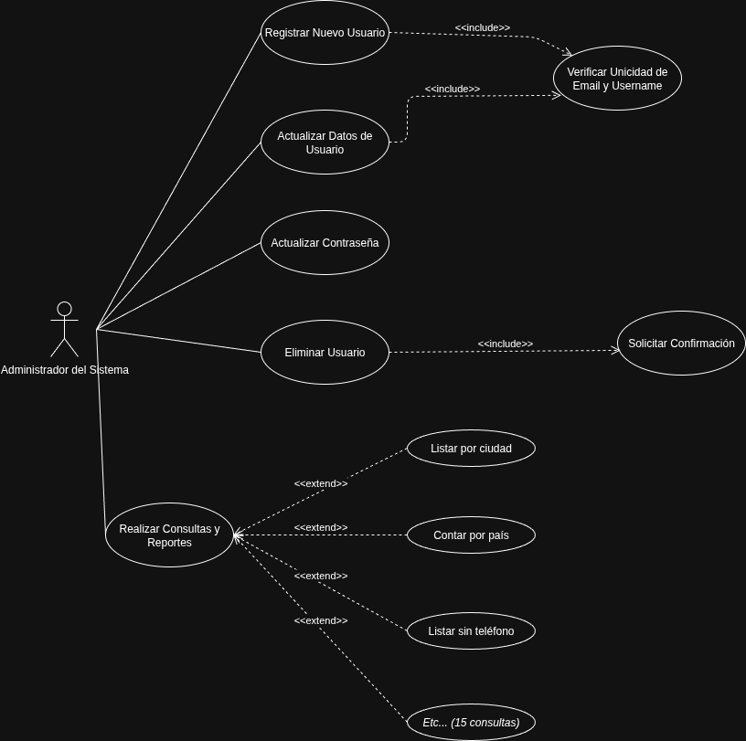
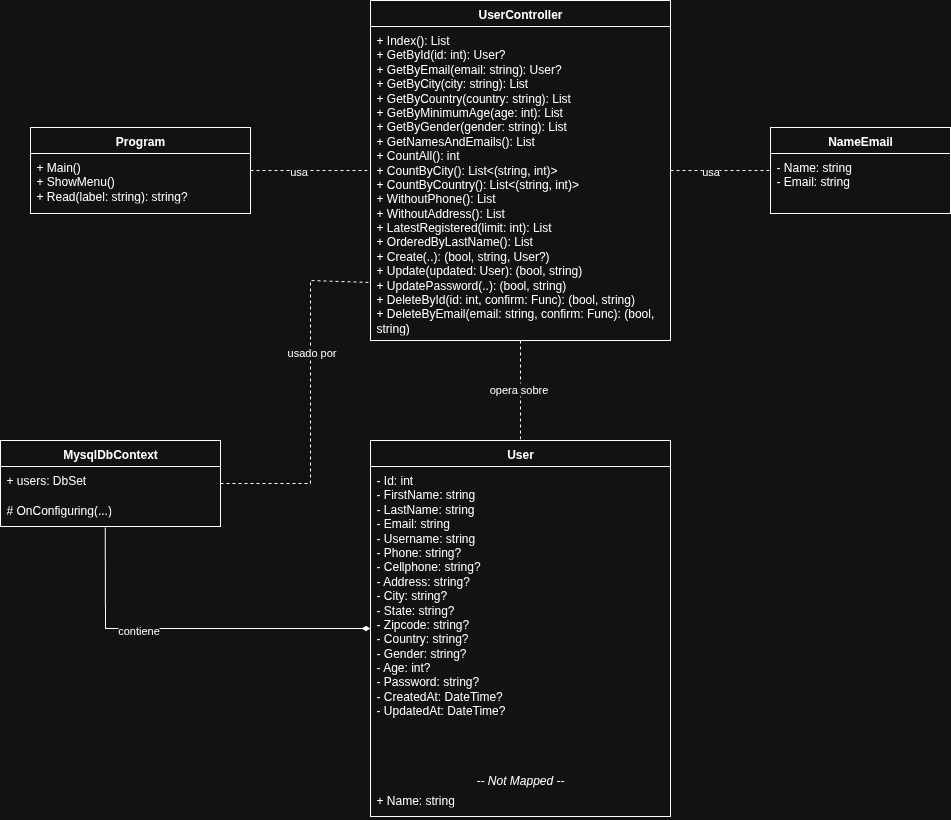
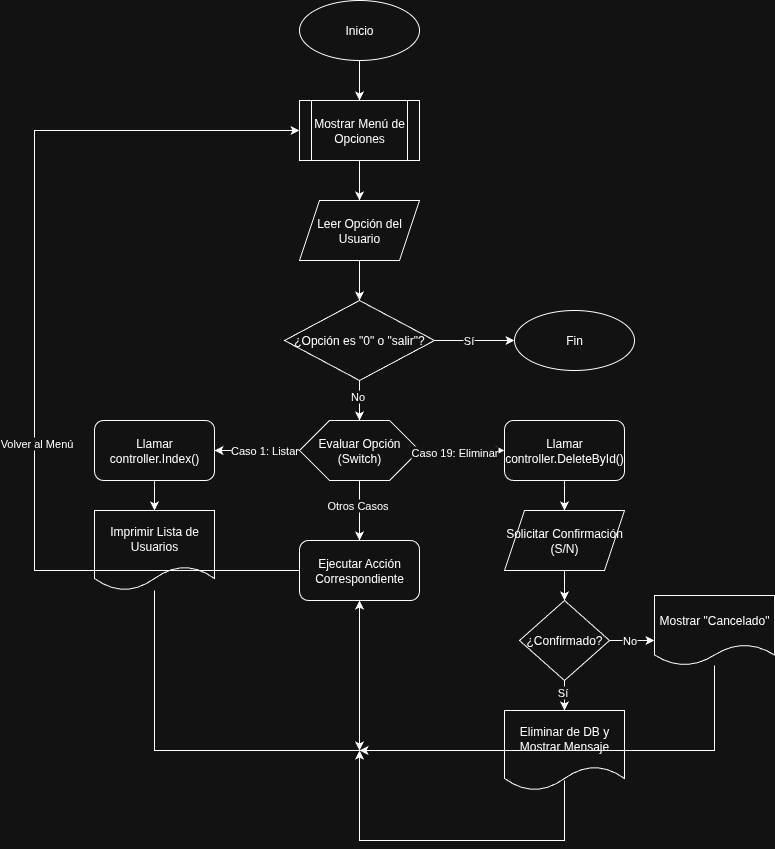

# Sistema de Gestión de Usuarios - Sprint2

## Descripción del Proyecto

Sistema de gestión de usuarios desarrollado en .NET 8.0 con Entity Framework Core y MySQL. Permite realizar operaciones CRUD completas sobre una base de datos de usuarios, incluyendo consultas avanzadas, validaciones robustas y manejo de transacciones.

## Objetivos

- Implementar un sistema completo de gestión de usuarios
- Proporcionar 15 consultas funcionales diferentes
- Garantizar la integridad de datos con validaciones
- Implementar operaciones CRUD con confirmaciones
- Aplicar patrones de diseño y buenas prácticas

## Arquitectura del Sistema

### Patrón de Diseño Implementado
- **Repository Pattern**: Separación de la lógica de acceso a datos
- **Dependency Injection**: Inyección de dependencias para desacoplamiento
- **MVC Simplificado**: Separación de responsabilidades entre capas

### Estructura del Proyecto
```
Sprint2/
├── Controllers/          # Lógica de presentación
│   └── UserController.cs
├── Data/                 # Acceso a datos
│   └── MysqlDbContext.cs
├── Models/               # Entidades de dominio
│   ├── User.cs
│   └── NameEmail.cs
├── Repositories/         # Patrón Repository
│   ├── IUserRepository.cs
│   └── UserRepository.cs
├── Utils/                # Utilidades
│   └── ValidationHelper.cs
├── Program.cs            # Aplicación console
└── Sprint2.csproj       # Configuración del proyecto
```

## Tecnologías Utilizadas

- **.NET 8.0**: Framework de desarrollo
- **Entity Framework Core 9.0.9**: ORM para acceso a datos
- **Pomelo.EntityFrameworkCore.MySql 9.0.0**: Proveedor MySQL
- **MySQL Server 8.0**: Base de datos
- **C# 12**: Lenguaje de programación

## Diagramas del Sistema

### Diagrama de Casos de Uso



El diagrama muestra las interacciones del **Administrador del Sistema** con las siguientes funcionalidades principales:

- **Registrar Nuevo Usuario**: Incluye verificación de unicidad
- **Actualizar Datos de Usuario**: Incluye verificación de unicidad
- **Actualizar Contraseña**: Con confirmación
- **Eliminar Usuario**: Incluye solicitud de confirmación
- **Realizar Consultas y Reportes**: Extiende a 15 consultas específicas

### Diagrama de Clases



El diagrama muestra la estructura de clases y sus relaciones:

- **Program**: Punto de entrada y lógica de menú
- **UserController**: Controlador con 20+ métodos para gestión de usuarios
- **MysqlDbContext**: Contexto de Entity Framework
- **User**: Entidad principal con 16 propiedades
- **NameEmail**: DTO para proyecciones de datos

### Diagrama de Flujo



El diagrama ilustra el flujo de la aplicación:

1. **Inicio** → **Mostrar Menú**
2. **Leer Opción** → **Evaluar Opción**
3. **Ejecutar Acción** → **Volver al Menú**
4. **Opción "0"** → **Fin**

## Instalación y Configuración

### Prerrequisitos
- .NET 8.0 SDK
- MySQL Server 8.0
- Visual Studio 2022 o VS Code

### Pasos de Instalación

1. **Clonar el repositorio**
```bash
git clone <repository-url>
cd net-pomelo-mysql
```

2. **Restaurar dependencias**
```bash
dotnet restore
```

3. **Configurar base de datos**
- Asegurar que MySQL esté ejecutándose
- Verificar la cadena de conexión en `Data/MysqlDbContext.cs`
- La base de datos `tren_cosmos` debe existir

4. **Compilar el proyecto**
```bash
dotnet build
```

5. **Ejecutar la aplicación**
```bash
dotnet run
```

## Funcionalidades Implementadas

### Consultas Funcionales (15/15)

| # | Funcionalidad | Opción | Descripción |
|---|---------------|--------|-------------|
| 1 | Listar todos | 1 | Reporte general de usuarios |
| 2 | Ver por Id | 2 | Consulta individual por ID |
| 3 | Ver por Email | 3 | Consulta por correo electrónico |
| 4 | Listar por ciudad | 4 | Segmentación geográfica |
| 5 | Listar por país | 5 | Estadísticas globales |
| 6 | Mayores de edad | 6 | Filtro por edad mínima |
| 7 | Por género | 7 | Filtro por género |
| 8 | Nombres y correos | 8 | Proyección para campañas |
| 9 | Contar total | 9 | Estadística global |
| 10 | Contar por ciudad | 10 | Reporte administrativo |
| 11 | Contar por país | 11 | Reporte estratégico |
| 12 | Sin teléfono | 12 | Depuración de datos |
| 13 | Sin dirección | 13 | Información incompleta |
| 14 | Últimos registrados | 14 | Ordenados por fecha |
| 15 | Ordenados por apellido | 15 | Listados alfabéticos |

### Operaciones CRUD

#### Crear Usuario (Opción 17)
- **Campos obligatorios**: Nombre, Apellido, Username, Email
- **Validaciones**: Unicidad de username y email
- **Confirmación**: Mensaje de éxito

#### Actualizar Usuario (Opción 18)
- **Actualización completa**: Todos los campos editables
- **Validaciones**: Unicidad y formato
- **Confirmación**: Requerida antes de guardar

#### Actualizar Contraseña (Opción 19)
- **Confirmación**: Nueva contraseña debe coincidir
- **Validación**: Longitud mínima 6 caracteres

#### Eliminar Usuario (Opciones 20-21)
- **Por ID**: Eliminación por identificador
- **Por Email**: Eliminación por correo
- **Confirmación**: "¿Está seguro de eliminar este usuario? (S/N)"

## Validaciones y Seguridad

### Validaciones de Entrada
- **Enteros positivos**: IDs, edades, páginas
- **Rangos numéricos**: Edades (0-120), tamaños (1-50)
- **Texto requerido**: Nombres, apellidos, ciudades
- **Email válido**: Formato correcto con regex
- **Género válido**: male/female/m/f
- **Teléfono opcional**: Mínimo 7 dígitos

### Validaciones de Negocio
- **Unicidad de username**: No duplicados
- **Unicidad de email**: No duplicados
- **Existencia de usuario**: Antes de actualizar/eliminar
- **Integridad referencial**: Validaciones en Repository

### Manejo de Errores
- **Try-catch**: En todas las operaciones críticas
- **Transacciones**: Rollback automático en errores
- **Mensajes descriptivos**: Errores claros para el usuario
- **Reintentos**: Validaciones con corrección de errores

## Base de Datos

### Configuración
- **Servidor**: MySQL 8.0
- **Base de datos**: `tren_cosmos`
- **Tabla**: `users`
- **Puerto**: 3307

### Estructura de la Tabla `users`
```sql
CREATE TABLE users (
    id BIGINT UNSIGNED AUTO_INCREMENT PRIMARY KEY,
    first_name VARCHAR(255) NOT NULL,
    last_name VARCHAR(255) NOT NULL,
    username VARCHAR(255) NOT NULL UNIQUE,
    email VARCHAR(255) NOT NULL UNIQUE,
    phone VARCHAR(255),
    cellphone VARCHAR(255),
    address VARCHAR(255),
    city VARCHAR(255),
    state VARCHAR(255),
    zipcode VARCHAR(255),
    country VARCHAR(255),
    gender VARCHAR(255),
    age INT,
    password VARCHAR(255),
    created_at TIMESTAMP,
    updated_at TIMESTAMP
);
```

## Características Técnicas

### Patrón Repository
- **Interfaz**: `IUserRepository` con 20+ métodos
- **Implementación**: `UserRepository` con transacciones
- **Separación**: Lógica de datos separada del controlador

### Transacciones
- **Operaciones críticas**: Create, Update, Delete
- **Atomicidad**: Operaciones completas o fallan
- **Rollback**: Automático en caso de errores

### Validaciones Centralizadas
- **ValidationHelper**: Clase estática con métodos reutilizables
- **Reintentos**: Usuario puede corregir errores
- **Mensajes**: Errores descriptivos y claros

### Arquitectura Async
- **Métodos async**: Todas las operaciones de base de datos
- **Performance**: Operaciones no bloqueantes
- **Escalabilidad**: Manejo eficiente de recursos

## Rendimiento y Optimización

### Consultas Optimizadas
- **LINQ eficiente**: Consultas optimizadas
- **Proyecciones**: Solo campos necesarios
- **Paginación**: Para listas grandes
- **Índices**: En campos de búsqueda

### Manejo de Memoria
- **Using statements**: Disposición automática de recursos
- **Lazy loading**: Carga bajo demanda
- **Connection pooling**: Reutilización de conexiones

## Pruebas y Validación

### Casos de Prueba Implementados
- **Validación de unicidad**: Username y email únicos
- **Validación de formato**: Email, teléfono, edad
- **Confirmaciones**: Eliminación y actualización
- **Manejo de errores**: Casos de fallo

### Escenarios Probados
- **Creación exitosa**: Usuario nuevo válido
- **Creación fallida**: Usuario duplicado
- **Actualización**: Modificación de datos
- **Eliminación**: Con y sin confirmación
- **Consultas**: Todas las 15 funcionalidades

## Uso del Sistema

### Menú Principal
```
Gestión de Usuarios
1) Listar todos
2) Ver por Id
3) Ver por Email
4) Listar por ciudad
5) Listar por país
6) Mayores de edad mínima
7) Por género
8) Nombres y correos
9) Contar total
10) Contar por ciudad
11) Contar por país
12) Sin teléfono
13) Sin dirección
14) Últimos registrados
15) Ordenados por apellido
16) Paginación de usuarios
17) Crear usuario
18) Actualizar usuario
19) Actualizar contraseña
20) Eliminar por Id
21) Eliminar por Email
0) Salir
```

### Ejemplos de Uso

#### Crear Usuario
```
Seleccione opción: 17
Nombre: Juan
Apellido: Pérez
Usuario: jperez
Email: juan.perez@email.com
Exito: Usuario creado correctamente.
```

#### Consultar por Ciudad
```
Seleccione opción: 4
Ciudad: Madrid
Exito: Usuarios en Madrid:
  1 - Juan Pérez - juan.perez@email.com
  2 - María García - maria.garcia@email.com
```

#### Eliminar Usuario
```
Seleccione opción: 20
Id a eliminar: 1
Advertencia: Usuario a eliminar: Juan Pérez (juan.perez@email.com)
¿Está seguro de eliminar este usuario? (S/N): S
Exito: Usuario eliminado correctamente.
```

## Despliegue

### Requisitos del Sistema
- **OS**: Windows 10+, Linux, macOS
- **RAM**: Mínimo 4GB
- **Espacio**: 100MB libres
- **Red**: Acceso a servidor MySQL

### Variables de Entorno
```bash
# Configuración de base de datos
DB_SERVER=168.119.183.3
DB_PORT=3307
DB_NAME=tren_cosmos
DB_USER=root
DB_PASSWORD=g0tIFJEQsKHm5$34Pxu1
```

## Mantenimiento

### Logs y Monitoreo
- **Console output**: Mensajes de estado
- **Error handling**: Captura de excepciones
- **Transaction logs**: Registro de operaciones

### Backup y Recuperación
- **Base de datos**: Backup regular de MySQL
- **Código fuente**: Control de versiones con Git
- **Configuración**: Documentación de cambios

## Soporte y Contacto

### Documentación Adicional
- **Código fuente**: Comentarios en línea
- **Diagramas**: UML actualizados
- **API**: Documentación de métodos

### Resolución de Problemas
- **Errores comunes**: Validación de entrada
- **Conexión DB**: Verificar credenciales
- **Dependencias**: Restaurar paquetes NuGet

## Licencia

Este proyecto es parte de un ejercicio académico y está destinado únicamente para fines educativos.

## Conclusión

El Sistema de Gestión de Usuarios implementa exitosamente todos los requisitos del enunciado:

- **15 consultas funcionales** implementadas
- **CRUD completo** con validaciones
- **Patrón Repository** aplicado
- **Transacciones** para integridad
- **Validaciones robustas** con reintentos
- **Arquitectura escalable** y mantenible

El sistema demuestra buenas prácticas de desarrollo en .NET y proporciona una base sólida para futuras extensiones y mejoras.

---

**Desarrollado usando .NET 8.0 y Entity Framework Core**